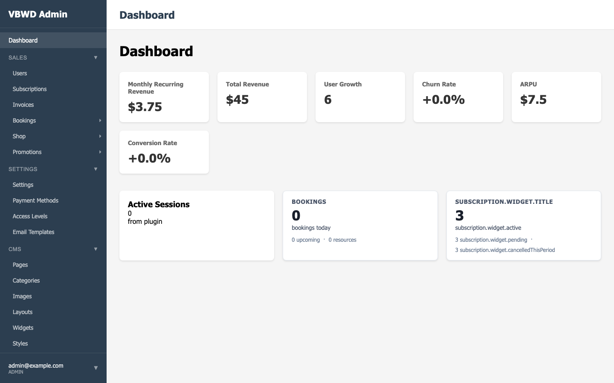
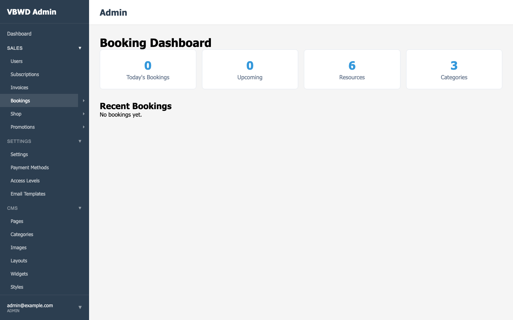
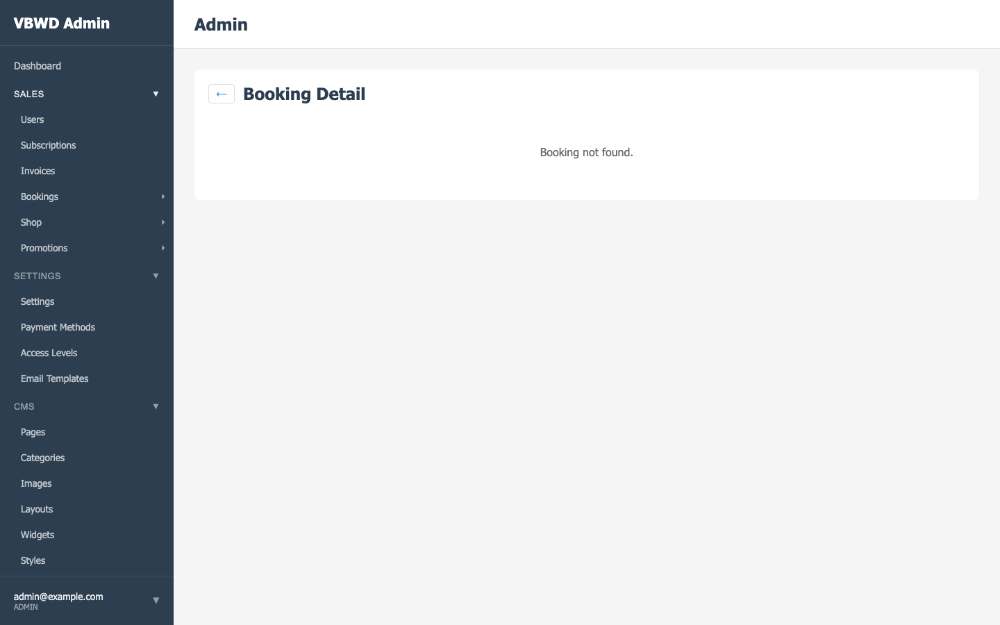
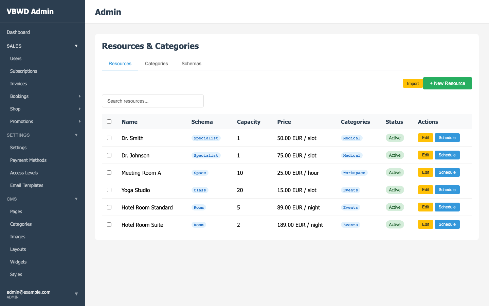

# Report 04 — Booking E2E Investigation & Fix

**Date:** 2026-06-01
**Repo:** `vbwd-plugin-booking` (CI), `vbwd-fe-admin/plugins/booking` (specs)
**Status:** ✅ **FIXED & GREEN** — all 18 e2e specs pass in CI (`2223142`).

## TL;DR

The booking repo's **E2E (Playwright)** job had been red since **before S43**.
Root cause was **not** the auth harness and **not** the S43 table rename — it
was the CI's `alembic upgrade head` (singular) aborting on the intentionally
**multi-head** migration graph, with the failure **masked by `|| true`**. The
DB was left empty → no admin user → every spec timed out on the post-login
redirect. Fixed by building the schema model-first with `create_all` + seeding
loudly. The booking backend (lint+unit+integration) was green throughout.

## How the failure presented

```
TimeoutError: page.waitForURL: Timeout 10000ms exceeded.   (→ /admin/dashboard)
```

17 of 18 specs failed identically — all on the `loginAsAdmin()` helper waiting
for the SPA to redirect to `/admin/dashboard` after submitting the login form.

## Root cause (from the CI logs, not a guess)

The E2E job's "Run migrations + seed" step:

```bash
docker compose exec -T api alembic upgrade head || true          # ← aborts
docker compose exec -T api flask seed-test-data || python -c "…"  # ← then fails
```

CI log:

```
ERROR [alembic.util.messaging] Multiple head revisions are present for given
argument 'head'; please specify a specific target revision … or 'heads' …
FAILED: Multiple head revisions are present …
…
psycopg2.errors.UndefinedTable: relation "vbwd_user" does not exist
  File ".../test_data_seeder.py", line 148, in _create_test_user
    existing = self.session.query(User).filter_by(email=email).first()
```

Chain of events:

1. The Alembic graph is **multi-head by design** — core and each plugin own a
   leaf revision (10 heads: `md_jsonb`, `20260422_1200`, `promptpay`,
   `meinchat_plus`, plus the six S43 prefix migrations). `upgrade head`
   (singular) cannot pick one and aborts.
2. `|| true` swallowed the abort, so **no tables were ever created**.
3. The fallback seeder then died on `relation "vbwd_user" does not exist`, and
   its `|| true` swallowed that too — the step "succeeded".
4. With no `admin@example.com`, the login form submit never authenticated, the
   app never routed to `/admin/dashboard`, and `waitForURL` timed out.

This was failing **before S43** (commits `340254c`, `c60c0e4` were already red
on e2e). S43 only renames backend tables; it touches no frontend/auth/CI code.

## Proof the test itself is sound (local reproduction)

Run against the local stack (which has a properly seeded admin user) at
`http://localhost:8081`:

```
plugins/booking/tests/e2e/booking-admin.spec.ts            17 passed
plugins/booking/tests/e2e/booking-resources-crud.spec.ts    1 passed
```

Screenshots captured live, logged in as `admin@example.com`, against the
**renamed** `booking_reservation` table (proving S43 works end-to-end):

### Admin dashboard (post-login redirect succeeds)


### Booking dashboard — 6 Resources / 3 Categories, stats render


### Booking list


### Booking resources


## The fix

`vbwd-plugin-booking/.github/workflows/tests.yml`, "Create schema + seed test
data" step:

- Build the schema **model-first** with `db.create_all()` — bulletproof for an
  e2e env and yields the correct post-S43 table names regardless of which
  plugin subset CI clones. (We don't need migration *history* for e2e; the
  up/down/up oracle covers that separately.)
- Keep `alembic upgrade heads` (**plural**) only as best-effort data seeding.
- **Drop `|| true` on the seed** so a seeding failure fails the job loudly.
- **Assert** `admin@example.com` exists after seeding → fail fast with a clear
  message instead of a 10 s redirect timeout.

## Result

CI run `2223142` — **all three jobs green**:

| Job | Result |
|-----|--------|
| CI — booking (lint + unit) | ✅ |
| Integration — booking | ✅ |
| E2E — booking (Playwright) | ✅ **18 passed** |

## Note — the same masked-migration pattern lives in other plugin CIs

Any plugin e2e job that copied `alembic upgrade head || true` + `|| true` seed
has the same latent trap (it only stays green by luck of a seeded DB). Worth a
follow-up sweep to apply the same create_all+loud-seed pattern across plugin
workflows. Out of scope here.
