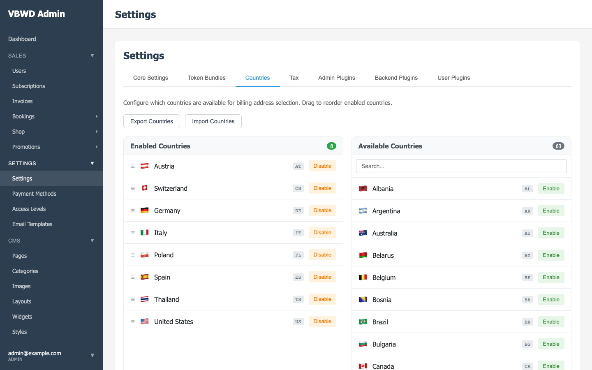
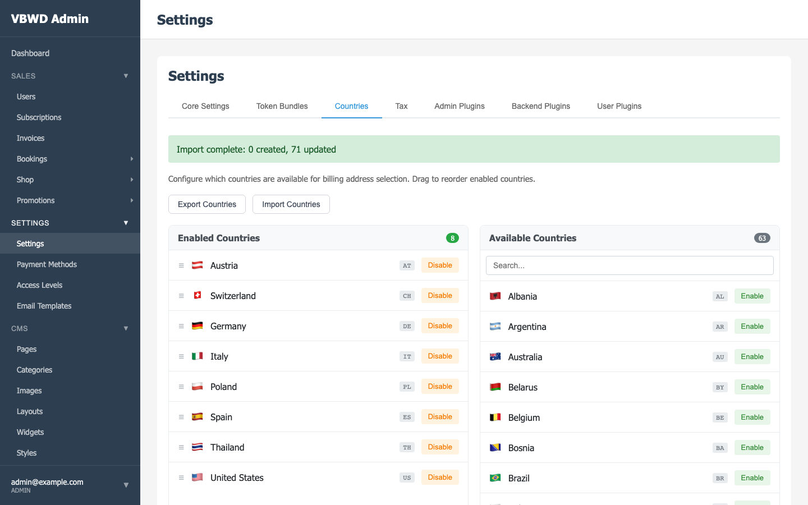

# Report 05 — Core `--full` Gate Fixes + Countries Export/Import

**Date:** 2026-06-01
**Repos:** `vbwd-backend` (core), `vbwd-fe-admin`
**Status:** ✅ All targeted failures fixed; new feature shipped + verified.

This session started from a red `bin/pre-commit-check.sh --full` on the core
backend (surfaced while validating S43) and a feature request.

## Part A — `--full` triage (core backend)

Core CI/main had been **red since before S43** (last green `77ea50e`; `5c3d6ef`
and `e28d4f3` already failing). Triaged each failure:

| Failure | Cause | Fix |
|---------|-------|-----|
| `test_infrastructure::test_database_tables_exist` | Asserted `vbwd_tarif_plan` / `vbwd_subscription` — renamed by S43.4 to `subscription_*`. A **core** test must not assert **plugin** tables (core-agnosticism). | Removed both plugin tables from the core expected-tables list. |
| 14 unit ERRORs in `test_rbac_seeder` + `test_create_admin` | `_wipe_rbac` deleted `Role`/`Permission` but never cleared `vbwd_user_roles` / `vbwd_user_access_level_permissions`; since S39 seeds an admin-with-role at startup, `DELETE FROM vbwd_role` hit the FK. Reproduces on a clean DB → real fixture bug, not S43. | Added the two association deletes to both `_wipe_rbac` helpers. → **16 passed**. |
| 7 `test_admin_countries` + 1 `test_admin_payment_methods` | These hit the live API and expect 36+ seeded countries + a default `invoice` payment method. The monolith migration creates the *tables* but seeds no *data*, and the dev DB was built via `create_all` (skips data) → 0 countries, no invoice method. | See below. |

### Foundational-data seeding (countries + payment methods)

- `vbwd_country`: already had a `seed_countries` service + `flask seed-countries`.
- `vbwd_payment_method` default `invoice`: **no seeder existed anywhere**.
  Added one mirroring the country pattern:
  - `vbwd/services/payment_method_seeder.py` — idempotent `seed_payment_methods`
    (4 unit tests).
  - `vbwd/cli/seed_payment_methods.py` — `flask seed-payment-methods`,
    registered in `app.py`.
- Wired the foundational seeders into `run_integration_tests()` in
  `bin/pre-commit-check.sh` (`seed-rbac` / `seed-countries` /
  `seed-payment-methods` / `seed-test-data`, with `FLASK_APP` set), so the
  admin-* suites pass cold-start, local and CI. Warn-and-continue (never silent
  `|| true` masking).

**Verified:** country + payment integration suites **49–50 passed**; RBAC
**16 passed**; new seeder **4 passed**; lint clean (flake8 @120, black).

## Part B — Countries manual export/import (feature request)

Two buttons on Settings → Countries: **Export Countries** / **Import
Countries**, JSON round-trip in the VBWD-standard envelope
`{"vbwd_export":"countries","version":1,"countries":[…]}`.

**Backend** (`vbwd/services/country_io.py` + routes in
`vbwd/routes/admin/countries.py`):
- `GET /api/v1/admin/countries/export` → downloadable envelope
  (`Content-Disposition: attachment; filename=vbwd-countries.json`), id/timestamp
  stripped so it's portable across instances.
- `POST /api/v1/admin/countries/import` → upsert by `code` (create missing,
  update name/enabled/position); validates the envelope; returns
  `{created, updated}`.
- Tests: `test_country_io.py` (9 unit) + 5 integration tests in
  `test_admin_countries.py`.

**Frontend** (`vbwd-fe-admin/vue/`):
- `stores/countries.ts`: `exportCountries()` + `importCountries(payload)`.
- `views/Settings.vue`: two buttons + hidden file input; export builds a Blob
  download, import reads the file → POST → refresh + success message; CSS uses
  `var(--vbwd-*)` (design-system compliant); en/de i18n keys.
- Tests: `tests/unit/stores/countries.spec.ts` (4). eslint clean.

**Verified end-to-end** against the live stack (Playwright): export downloaded
`vbwd-countries.json` (71 countries); re-import returned `{created:0,
updated:71}`; success banner rendered.

### Screenshots

