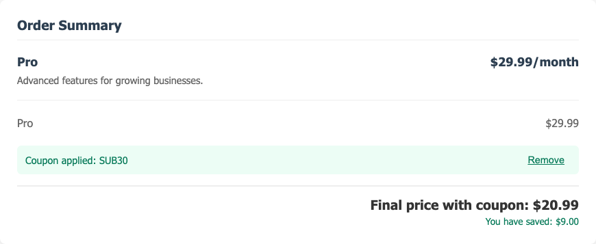
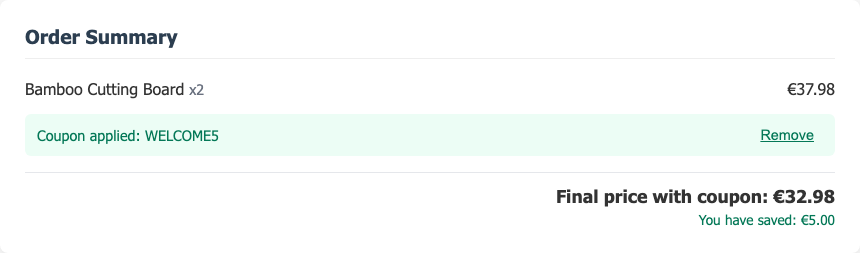
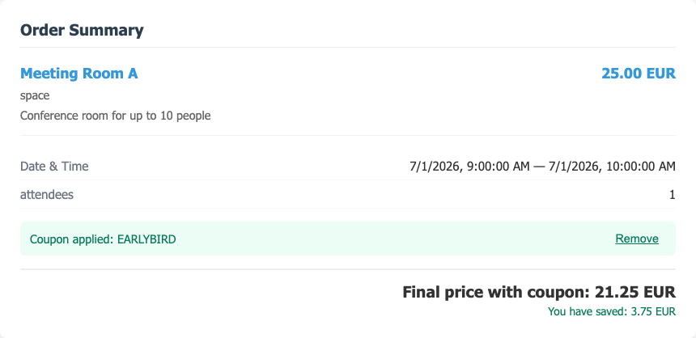
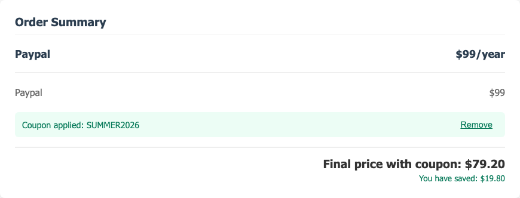

# Report 08 — Discounts & Coupons Working Across All Checkouts

**Date:** 2026-06-02
**Sprint:** [S36](../done/s36-discounts-at-checkout.md) (+ booking extension)
**Status:** ✅ Coupons apply and reduce the price in **subscription, shop,
booking, and GHRM** checkouts — captured live against the running stack
(`localhost:8080`, user `test@example.com`).

All four go through the **same generic core seam**
(`checkout_price_adjustment_registry`) — the discount plugin owns the math; no
checkout imports it. Each screenshot is the live order summary after applying a
seeded coupon.

## 1. Subscription checkout — `SUB30` (30% off)
`/dashboard/checkout/pro` — Pro plan $29.99 → **−$9.00** → **$20.99**.

## 2. Shop checkout — `WELCOME5` (€5 off, min €25)
`/checkout?source=shop` — cart €37.98 → **−€5.00** → **€32.98**.

## 3. Booking checkout — `EARLYBIRD` (15% off, BOOKING scope)
`/booking/meeting-room-a/book/pay` — Meeting Room A 25.00 EUR → **−3.75 EUR** →
**21.25 EUR**.

## 4. GHRM package checkout — `SUMMER2026` (20% off, GLOBAL)
GHRM packages **are** subscription plans (FK `ghrm_software_package.tariff_plan_id
→ subscription_tarif_plan`), so "Get Package" routes through the subscription
checkout and inherits full coupon support. Package "Paypal" $99 → **−$19.80** →
**$79.20**.

## How each checkout is wired

| Checkout | Endpoint | Scope | Coupon support |
|----------|----------|-------|----------------|
| Subscription | `POST /user/checkout` | `SUBSCRIPTION` | S36 (handler → registry) |
| Shop | `POST /shop/cart/checkout` | `ECOMMERCE` | S36 (route → registry) |
| **Booking** | `POST /booking/checkout` | `BOOKING` | **Booking extension** (route → registry + `BookingCheckout.vue` coupon input) |
| GHRM | `POST /user/checkout` (package's plan) | `SUBSCRIPTION` | Inherited — GHRM = subscription checkout |

The booking extension was added for this report (it was not in S36's original
subscription+shop scope): `plugins/booking/booking/routes.py` consumes the
registry (scope `BOOKING`), and `BookingCheckout.vue` renders the shared
`CouponInput`. Backend proof: `test_booking_checkout_with_coupon.py` — **2 passed**
(BOOK20 → invoice reduced 20%; invalid → 400, no invoice).

## Honest notes
- **GHRM packages are seeded as free (€0) plans** — a coupon on them is €0. To
  show a real discount, the "Paypal" package's plan was **temporarily priced at
  $99 via the admin API for the screenshot, then reverted to $0** (verified
  back at 0.00). The mechanism is genuine: any priced GHRM package discounts
  exactly like the subscription demo (same checkout + code path).
- Two cosmetic fixes made for these shots: removed the duplicate gross total in
  `ShopCheckoutSummary` (the view's net order-total is authoritative) and
  hardcoded the booking discount label.
- Scope correctness holds (proven separately): e.g. `SUB30` is rejected on an
  `ECOMMERCE`/`BOOKING` checkout — `/coupons/validate` honours the scope.

## Checkout-summary UX polish (2026-06-02)

Per review feedback, the order-summary total block was reworked across all
checkouts (public, private subscription, booking) — the screenshots above
reflect it:

- The **coupon input is hidden when there is nothing to pay** (total = 0, e.g. a
  free GHRM package).
- Removed the **duplicate total** the plugin summary components rendered; the
  checkout view now owns a single net total, styled to match the existing
  `.total` look (border-top, right-aligned, bold), with margin above the coupon.
- The total reads either **"Total: X"** (no coupon) or, when applied,
  **"Final price with coupon: X"** + a **"You have saved: Y"** line.

All coupon e2e (public + private + admin-injected) stay green after the rework.

**Not committed** (standing rule).
